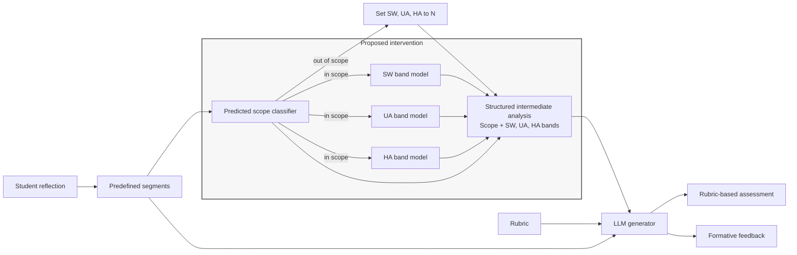

# Structured Intermediate Analysis for LLM-Based Assessment and Feedback

In this experiment, we investigate whether an LLM produces higher quality assessment and feedback, when given structured analysis of a learner's reflection.

The intervention is **analysis-mediated generation**: for each predefined segment, the system first outputs scope-decision; in-scope segments receive component-specific bands for 3 reflection dimensions, namely SW/Perception, UA/Analysis, and HA/Alternatives. Both reflection dimensions and performance band analysis are then supplied to the generator as a structured intermediate representation.

**Status:** 

- Segment-classification notebooks and an R1 development batch for G1/G2/G3 are available.
- Full test-set prediction, adjudicated G3 analysis, and confirmatory evaluation remain in progress.

## Human Rating UI

The standalone browser app lives in [rating-ui/](rating-ui/) as a Git submodule of
the public [prebi-rating-ui repository](https://github.com/nguyenhongquy/prebi-rating-ui).
This research repository pins an exact UI commit. The app opens to expert
onboarding and does not require the other repository's workbench, a Python API,
or a model provider. Node.js 22.12 or newer is required.

Clone this repository with `git clone --recurse-submodules`, or initialize the
submodule in an existing clone before installing dependencies:

```bash
git submodule update --init --recursive
npm --prefix rating-ui ci
npm --prefix rating-ui run dev
```

1. Open the localhost URL printed by Vite (normally `http://127.0.0.1:5174`).
2. Upload only blinded packet JSON, never the protected condition key.
3. Drafts and submitted ratings stay in browser-local storage; download results for protected collection.
4. See [rating-ui/README.md](rating-ui/README.md) for build and data-handling details.

For UI development, work inside the submodule on a branch (for example,
`git -C rating-ui switch main`), then commit and push UI changes to its public
repository. Record the new UI revision in this research repository with
`git add rating-ui` and a parent-repository commit. After pulling research
repository updates, run `git submodule update --init --recursive` to check out
the pinned UI revision. Pushing UI commits to its `main` branch triggers GitHub
Pages deployment independently of this private repository.

Research packets, condition keys, credentials, and rating exports must remain
outside the public submodule. Use this submodule as the authoritative UI working
copy rather than maintaining a second independent copy.

## Running the Notebooks

| Order | Notebook                                                                      | Purpose                                                  |
| ----- | ----------------------------------------------------------------------------- | -------------------------------------------------------- |
| 00    | [00_segment_classification_ml.ipynb](00_segment_classification_ml.ipynb)       | Classical machine-learning segment classification        |
| 01    | [01_segment_classification.ipynb](01_segment_classification.ipynb)             | GBERT segment classification                             |
| 02    | [02_segment_inference.ipynb](02_segment_inference.ipynb)                       | Saved-model segment inference                            |
| 03    | [03_generate_g1_g3.ipynb](03_generate_g1_g3.ipynb)                             | Paired G1/G3 generation                                  |
| 04    | [04_generate_g2.ipynb](04_generate_g2.ipynb)                                   | G2 generation matched to predictions and G1/G3 artifacts |
| 05    | [05_segment_evaluation.ipynb](05_segment_evaluation.ipynb)                     | Segment evaluation                                       |
| 06    | [06_feedback_implied_score_pilot.ipynb](06_feedback_implied_score_pilot.ipynb) | Feedback-implied score pilot                             |
| 07    | [07_rating_packet_export.ipynb](07_rating_packet_export.ipynb)                 | Local preflight and protected blinded-packet export      |
| 08    | [08_llm_judge_pilot.ipynb](08_llm_judge_pilot.ipynb)                           | Protected LLM assessment/feedback quality judging       |
| 09    | [09_llm_judge_analysis.ipynb](09_llm_judge_analysis.ipynb)                     | Descriptive judge-result and optional human comparison  |
| 10    | [10_generation_consistency.ipynb](10_generation_consistency.ipynb)             | Independent G1/G2/G3 repetitions and categorical agreement |

- Training, provider calls, and exports retain their explicit switches.
- Segment evaluation can run after inference independently of generation.

The generation-consistency notebook defaults to local preflight and no provider calls.
It freezes five repetitions, the generation prompts/rubric, saved G2 GBERT analysis,
and G3 observed human candidate annotations. Four playground and 18 test documents
remain separate. Explicit approvals cover external processing, category encoding,
and older G2 artifact provenance; test additionally requires a frozen-protocol gate.
Fresh repetitions are interleaved, privately saved, and resumable without double-counting.
Exact decimal-score categories are the default because existing generation returns decimal
scores. Categorical rubric bands require a complete explicit mapping and rationale before
generation; no automatic rounding is used. Reports include pairwise exact agreement,
unanimous consistency, ordinal/nominal Krippendorff alpha, category frequencies, missing
coverage, all-pairs cross-condition agreement, and exploratory paired author-cluster
bootstrap contrasts. This is generation repeatability, not judge repeatability or correctness.

The opening section of [05_segment_evaluation.ipynb](05_segment_evaluation.ipynb) compares TF-IDF ML with the saved direct GBERT cascade on the complete test split.
Run Cells 1-5 independently of the optional saved-artifact workflow below them. In Cell 2, set `RUN_MODEL_COMPARISON=True` and either provide a trusted
`ML_MODEL_PATH` (also accepted through `PREBI_ML_MODEL_PATH`) or set
`SELECT_ML_ON_DEV=True` to select settings using train/dev only. Set
`GBERT_DEVICE='mps'` on supported Macs or leave the CPU default. GBERT uses cached
tokenizer/config files and local checkpoints only; no provider calls or downloads
occur. The shared scorer retains candidate bundles and reports scope, skills on
gold scope, and end-to-end labels, with fixed-label and supported-class macro-F1,
per-class support, a comparison chart, and local timing. Timing includes GBERT
head loading and is not warmed-throughput benchmarking. Older GBERT metadata
lacks training-split fingerprints, so verify its training export before treating
the comparison as confirmatory. `SAVE_COMPARISON=True` exports aggregate metrics
and provenance only to approved protected storage.

The packet-export notebook builds 42 R1 development packets from saved generation
artifacts and the config-pinned human-feedback CSV. It defaults to
`WRITE_PACKETS = False`, prints counts rather than research text, and makes no
provider or tracing calls. To export, enable writing in Cell 2 and rerun Cells 2,
3, and 5. Upload only the packet bundle to the rating UI; keep the condition key
restricted. Existing exports are never overwritten.

From the `prebi_v1` project root, install the environment and optional Gemini integration:

```bash
uv sync --locked --extra dev --extra gemini
```

Open a notebook in VS Code and select the workspace `.venv` Python kernel. Keep the working directory at the `prebi_v1` project root so relative data paths resolve.

Shared, non-secret experiment settings are in [config/experiment.toml](config/experiment.toml): data selectors and paths, classifier hyperparameters, generator model and repetitions, expected prompt/rubric versions, tracing preference, and evaluation seed. The notebooks load this file through `reflection_assessment_feedback.experiment_config`; persisted prediction and generation artifacts include its SHA-256 fingerprint. Keep API keys and `PREBI_DATA_ROOT` in the local `.env`, not in TOML. Runtime actions such as training, writing predictions, provider approval, and metric export remain explicit notebook switches.

Versioned prompt artifacts and human coding protocols live under [prompts/](prompts/), indexed by [prompts/manifest.json](prompts/manifest.json). The active generation prompt is `generation@1.4.0`; its G2 predicted-analysis and G3 observed-human-analysis supplemental sections are separate versioned prompt fragments. Human assessment and feedback protocols remain pinned to assessment `0.3.0` and feedback `0.2.0`, with three-point ratings plus unable-to-judge. The German LLM-judge prompts are separately pinned to assessment `0.5.0` and feedback `0.3.0`. Both include matched teacher-educator feedback as an expert reference; the assessment judge also receives aggregate candidate-grain gold scope/band counts, missingness, review, and ambiguity summaries. These references inform judgments but are not treated as infallible gold labels or exact targets. Assessment criteria are Score-Rubric Fit, Evidence Support, and Justification Quality; feedback criteria are Correctness and Developmental Usefulness. Feedback-implied coding remains raw scores 0.0-3.0 in tenths, with human guide `0.1.0` and LLM prompt `0.2.0`. All rating instruments are development drafts requiring calibration before confirmatory use. `reflection_assessment_feedback.prompt_registry` verifies artifact hashes and renders templates with exact variable checking. The rubric is a separate versioned instrument under [rubrics/](rubrics/), not prompt text. New generation runs store prompt-component, rubric-artifact, and fully rendered prompt hashes; rating records likewise store prompt and input provenance.

The feedback-implied score pilot entry point is [06_feedback_implied_score_pilot.ipynb](06_feedback_implied_score_pilot.ipynb), backed by `reflection_assessment_feedback.feedback_implied_scoring`. Its preflight is local-only; the LLM execution cell defaults to `APPROVE_EXTERNAL_PROCESSING = False`. The R1 pilot contains six documents and infers scores separately for SW, UA, and HA. It records `not_inferable` rather than forcing a score, validates evidence offsets against the human feedback, rate-limits provider calls, and writes run records only under protected `PREBI_DATA_ROOT`.

Never edit a registered protocol version or exported packet in place. Existing
`0.1.0` quality packets retain their five-point scale and original criteria; the
UI reads the scale and anchors from each packet. New exports use the config-pinned
guides (assessment `0.3.0`, feedback `0.2.0`). Assessment `0.2.0` packets retain
their four criteria. Preserve old packets and ratings separately and do not pool scores
across protocol versions. The exporter still refuses to overwrite existing files.

### 1. Segment classification

For a fast CPU-only alternative, open [00_segment_classification_ml.ipynb](00_segment_classification_ml.ipynb).
The reusable implementation is [reflection_assessment_feedback/segment_classification_ml.py](reflection_assessment_feedback/segment_classification_ml.py).
It combines word 1-2 grams and character 3-5 grams with logistic regression,
and optionally compares LinearSVC. Both direct (4 heads) and hierarchical
presence-then-band (7 heads) cascades are supported. Training preserves candidate
bundles, honors canonical quality exclusions, and uses a configurable 10-character
minimum. Author/document/segment separation is checked before fitting; vocabulary
and heads learn only from train. Dev selects settings using mean end-to-end
macro-F1 over gold-supported labels, while reports retain fixed-label per-class
metrics, including zero-support classes. Skills are also evaluated on gold scope.

Run the ML notebook in order with its defaults first. Set `RUN_TRAINING=True` in
Cell 2 to run the dev comparison. `RUN_TEST_EVALUATION` separately enables final
test reporting; never tune from those results. Set `SAVE_MODEL=True` to save the
selected model, settings, train/dev file hashes, and dev results under protected
`PREBI_DATA_ROOT/segment-classification-ml/`. TF-IDF vocabularies can retain
research terms: do not commit models or save them in the source tree. Joblib
loading executes serialized code; load only your own trusted artifacts with the
same scikit-learn version used for training.

For ML-backed G2, in [04_generate_g2.ipynb](04_generate_g2.ipynb) set
`PREDICTION_BACKEND='tfidf'`, provide `ML_MODEL_PATH`, and enable
`WRITE_ML_PREDICTIONS` in the prediction-loading cell. This performs local
inference without provider calls and stores predictions under
`PREBI_DATA_ROOT/g2/predictions/tfidf/<model-sha256>/`. Config, model, document,
source, and coverage checks run before generation. Prediction hashes distinguish
downstream G2 runs. GBERT remains the default and its artifacts are unchanged;
do not pool classifier versions or backends in evaluation.

Open [01_segment_classification.ipynb](01_segment_classification.ipynb) and run cells in order. The initial cells validate the prepared train/dev/test splits, show label distributions, and define the GBERT training and evaluation functions. Training is opt-in: in **Train and evaluate**, change `RUN_TRAINING` from `False` to `True`, then run that cell and the following evaluation cell. This downloads `deepset/gbert-base`, trains both classifier variants, evaluates on the held-out test split, and writes checkpoints and summaries under `artifacts/segment-classification/`. Keep artifacts and research data private. Do not use test results to choose models or hyperparameters.

### 2. G1/G3 generation demo

The current generation cohort contains 18 reference-complete test documents, selected through `config/experiment.toml`: exclude all documents by the author of document 188 and explicitly exclude documents 218 and 221. Selection is not based on essay name. [03_generate_g1_g3.ipynb](03_generate_g1_g3.ipynb) loads each document's candidate-grain human annotations, including review flags, alternatives, and missing values; it does not adjudicate or flatten them. G3 therefore represents generation with observed, imperfect human analysis, not an oracle condition. The notebook makes one G1 and one G3 Gemini request per document and stores a separate protected comparison artifact per document. Requests share a lock-based 7.5-second minimum interval. Provider processing is gated by `APPROVE_EXTERNAL_PROCESSING`; approved batches use tracing. Traces may contain full reflections, prompts, and outputs; configure the LangSmith credentials in `.env` and ensure project access and retention are approved.

[02_segment_inference.ipynb](02_segment_inference.ipynb) runs the four local classifiers over the configured generation cohort and saves one predicted-analysis artifact per document under `PREBI_DATA_ROOT/g2/predictions/`. [04_generate_g2.ipynb](04_generate_g2.ipynb) checks each artifact against the matching G1/G3 pair, then generates and persists one G2 run per document under `PREBI_DATA_ROOT/g2/demo-runs/`. The historical R1 development batch used 18 Gemini generation requests total (six documents × three conditions) at one repetition. It is distinct from the current author-excluded cohort and is not a confirmatory batch.

For G2-only evaluation using the new author-disjoint direct GBERT run, use
[scripts/evaluate_g2_direct_gbert.py](scripts/evaluate_g2_direct_gbert.py):

```sh
.venv/bin/python scripts/evaluate_g2_direct_gbert.py --phase prepare
.venv/bin/python scripts/evaluate_g2_direct_gbert.py --phase all --approve-external-processing
```

The local prepare phase validates checkpoints and split hashes and predicts all
18 documents. The approved external phase generates G2 with the configured
Gemini model, then judges assessment and feedback quality with the configured
OpenAI model. This G2-only batch does not regenerate G1/G3. Predictions, generated
outputs, blinded packets, and ratings are isolated under
`PREBI_DATA_ROOT/g2/author-disjoint-evaluation/`, keyed by input provenance; reruns
reuse validated completed records. Aggregate scores are written under
`artifacts/g2-author-disjoint-judge/`. Invalid evidence IDs or judge outputs are
retried up to three times and otherwise fail; they are never accepted silently.

For five-repeat consistency of the new direct-GBERT G2 predictions against the
frozen historical G1/G2/G3 outputs, use
[scripts/rerun_g2_generation_consistency.py](scripts/rerun_g2_generation_consistency.py):

```sh
.venv/bin/python scripts/rerun_g2_generation_consistency.py --phase prepare
.venv/bin/python scripts/rerun_g2_generation_consistency.py --phase generate --approve-external-processing
.venv/bin/python scripts/rerun_g2_generation_consistency.py --phase analyze
```

This separate protocol uses the same 18 author-excluded test reflections and
exact-decimal score policy as the historical consistency experiment. It validates
and reuses 270 historical test generations, then generates 90 fresh G2 outputs
(five per reflection). The single-output judge batch is not counted as a repeat.
The historical conditions and new G2 remain four distinct variants. Source inputs
and repeat outputs stay under protected
`PREBI_DATA_ROOT/generation-consistency-g2-author-disjoint/`; aggregate metrics
are exported under `artifacts/g2-generation-consistency/`.

[10_generation_consistency.ipynb](10_generation_consistency.ipynb) contains a
standalone new-G2 comparison section with pairwise exact agreement, unanimous
agreement, nominal/ordinal Krippendorff alpha, and exploratory author-cluster
bootstrap differences. The analysis uses corrected author IDs and withholds
complete comparisons until every reflection has five valid repetitions.
Repeatability does not establish assessment accuracy or feedback quality;
historical baselines also differ in generation date, so comparisons are descriptive.

The judge workflow separates a playground from final test analysis. Playground mode selects the four test-split reflections by the author group of exploratory document 188: documents 3, 64, 126, and 188. Excluding this author from the 24-document classifier test set leaves 20 documents; explicitly excluding documents 218 and 221, which lack teacher-feedback records, leaves 18 reference-complete test reflections. Other authors' R1 reflections remain eligible. The source split remains unchanged. Existing generation and judge artifacts are retained. Assessment prompt `0.5.0` uses aggregate candidate-grain gold-analysis summaries. Never pool the playground author's scores into final test summaries. Missing or ambiguous teacher-reference records in the selected cohort cause an explicit error rather than silently shrinking the cohort. Treat all results as descriptive pilot evidence, not confirmatory findings.

## Research Questions

**RQ1.** Does structured intermediate analysis of reflection performance improve the accuracy and consistency of rubric-based assessment in an LLM-based system?

**RQ2.** Does structured intermediate analysis improve the diagnostic precision of generated formative feedback and its potential to stimulate learners to reflect more deeply?

We hypothesize that, compared with direct generation, analysis-mediated generation will produce more accurate and consistent rubric-based assessments (**H1**) and formative feedback with greater diagnostic precision and greater potential to stimulate learners to reflect more deeply (**H2**).

## Experimental Conditions

The experiment uses the same reflection texts, rubric, generator model, prompt template and shared prompt content, output schema, and generation settings across conditions. The only condition-specific addition to the generator input is segment analysis: it is omitted in G1, predicted in G2, and human-annotated in G3.

| Condition                                         | Generator input                                                                                 | Role                      |
| ------------------------------------------------- | ----------------------------------------------------------------------------------------------- | ------------------------- |
| G1<br />Direct generation                         | Segmented reflection + rubric                                                                   | Baseline                  |
| G2<br />Predicted-analysis-mediated intervention | Segmented reflection + rubric + predicted segment analysis                                    | Proposed                  |
| G3<br />Observed-human-analysis-mediated          | Segmented reflection + rubric + candidate-grain human analysis, including review/unknown states | Human-reference condition |

---

The same prompt template, shared prompt content, and all other generator inputs are used in every condition. G2 and G3 differ in the supplied analysis source: predicted analysis versus recorded human candidate annotations. For the R1 development batch, G3 preserves ambiguity, candidate alternatives, review flags, and missing values; it is not a perfect oracle. Interpret G2 → G3 as a comparison against observed human analysis, and report analysis completeness/review status alongside the condition results.

## Proposed Pipeline



For G2, a predicted scope decision runs first. Out-of-scope segments receive `N` for all three components; in-scope segments are passed to three parallel band classifiers, one each for SW, UA, and HA. G3 uses human annotations for both scope and component bands. The original segmented reflection remains available to the generator; the structured intermediate analysis enriches, rather than replaces, the source text.

## Conceptual Data Model

The diagram is explanatory, not the implementation contract. When the experiment is implemented, versioned schemas and validation tests under `experiments/extended_abstract/schemas/` and `experiments/extended_abstract/tests/` will be authoritative for structure and enforceable invariants. Research decisions such as rubric score levels, overall-score aggregation, and annotation rules belong in `experiments/extended_abstract/experiment_protocol.md`. These implementation files are planned and do not exist yet.


The experiment runner creates `run_id` and stores it with the generation output and run metadata. The model-generated payload contains only the assessment and feedback. Analysis is absent for G1 and required for G2 and G3.

### Illustrative Contract Examples

The examples below explain the intended shape; they are not normative schemas. The versioned schemas and tests will define and enforce exact fields and validation rules, including unique segment IDs, complete one-to-one analysis coverage for G2/G3, no analysis for G1, scope-to-label consistency, and scores constrained by the rubric.

A segment-level intermediate analysis records scope and one label for each component:

```json
{
  "analysis_source": "predicted",
  "segments": [
    {
      "segment_id": "segment_01",
      "scope": "in_scope",
      "component_bands": {
        "SW": "B",
        "UA": "0",
        "HA": "0"
      }
    },
    {
      "segment_id": "segment_02",
      "scope": "out_of_scope",
      "component_bands": {
        "SW": "N",
        "UA": "N",
        "HA": "N"
      }
    }
  ]
}
```

The predicted scope decision runs before the component models. If a segment is `out_of_scope`, the pipeline assigns `N` to all components and skips the component models. If it is `in_scope`, the three component models run in parallel and each predicts one of `0`, `A`, `B`, or `C`. `0` means there is no evidence for that component in an in-scope segment; `A`, `B`, and `C` are the component's reflection-performance bands. `N` means the whole segment is outside the reflection performance and is not a component band. The band descriptors and annotation rules must be defined consistently for predicted and human analyses.

For G3, `analysis_source` is `human`. G1 omits intermediate analysis.

All conditions produce the same model-generated payload shape; the runner adds the run ID separately:

```json
{
  "assessment": {
    "overall_score": 0,
    "component_scores": [],
    "justification": "...",
    "evidence": []
  },
  "feedback": {
    "text": "..."
  }
}
```

The experiment protocol must define the rubric score levels and how `overall_score` is derived from dimension scores before the output schema is frozen.

## Evaluation

The proposed operationalization evaluates assessment and feedback separately. Human reference scores and segment annotations should be finalized independently of the generated outputs. G1 vs G2 is the primary comparison; G2 vs G3 is a secondary development comparison against observed human analysis. Because the current G3 batch preserves unresolved annotation states, it does not estimate a clean oracle headroom effect.

### Deterministic metrics

| Outcome                         | Metric and computation                                                                                                                                                                                                                                                                                                                               |
| ------------------------------- | ---------------------------------------------------------------------------------------------------------------------------------------------------------------------------------------------------------------------------------------------------------------------------------------------------------------------------------------------------- |
| Assessment accuracy (RQ1/H1)    | Mean absolute error (MAE) against adjudicated human reference scores, reported separately for overall score and each rubric dimension. Also report exact agreement on the rubric's allowed score levels.                                                                                                                                             |
| Assessment consistency (RQ1/H1) | For each reflection and score (overall and each dimension), calculate the standard deviation across repeated generations. Report the mean within-reflection standard deviation by condition; lower values indicate greater consistency.                                                                                                              |
| Predicted scope classifier      | Report per-class precision, recall, and F1, plus macro-F1, against human scope annotations.                                                                                                                                                                                                                                                          |
| End-to-end component labels     | For each of SW, UA, and HA, compare the full pipeline output with human labels across all segments, including`N` for out-of-scope segments. Report exact accuracy and macro-F1 across `N`, `0`, `A`, `B`, and `C`, plus class support and confusion matrices. This captures errors in both the scope gate and component-band classifier. |

For condition comparisons, first summarize repeated runs within each reflection, then compare conditions using paired reflection-level differences. Report 95% bootstrap confidence intervals by resampling reflections; do not treat repeated runs from one reflection as independent observations.

### Multidimensional rating criteria

Human raters and LLM judges use the same task-specific criteria and 3-point
anchors. Human packets show reflection, rubric, and the generated assessment or
feedback. The LLM judge additionally sees the teacher-educator feedback for that
reflection as an expert reference. The judge must consider it without treating
it as infallible or requiring wording overlap. Both workflows hide condition,
generator identity, intermediate analysis, and run metadata.

| Task                | Criterion                | Main question                                                                 |
| ------------------- | ------------------------ | ----------------------------------------------------------------------------- |
| Assessment`0.3.0` | Score-Rubric Fit         | Is the assigned score plausible given reflection and rubric anchors?          |
| Assessment`0.3.0` | Evidence Support         | Does the cited evidence actually support the claims?                          |
| Assessment`0.3.0` | Justification Quality    | Does the rationale clearly explain how evidence and rubric lead to the score? |
| Feedback`0.2.0`   | Correctness              | Are claims accurate and defensible? Explicit citations are not required.      |
| Feedback`0.2.0`   | Developmental usefulness | Is there a clear, relevant next step or productive reflective direction?      |

Use the criterion-specific anchors in the registered protocols and packet.
Score each criterion separately (`1`, `2`, or `3`), or null with unable-to-judge
and a reason for missing information. Evidence validity and reasoning clarity
are separate judgments. Report criterion-level distributions without averaging
them into an overall quality score. Freeze judge settings and calibrate the
anchors before full evaluation. LLM ratings are preliminary automated evidence,
not a substitute for human ratings.

### Human multidimensional ratings

For human validation, at least two teacher-educator raters independently score a prespecified sample. For each reflection, select one run per condition using a fixed random seed before rating; use the same selected G1, G2, and G3 outputs for multidimensional and pairwise ratings. Raters see the reflection, rubric, and generated output, but not condition or intermediate analysis.

Report quadratic weighted Cohen's kappa per criterion from the independent ratings before adjudication. Resolve disagreements through a documented adjudication process. Then, for each of G1, G2, and G3, report the number of reflections rated and, for each criterion, the count and proportion at scores 1, 2, and 3, plus the median and interquartile range of adjudicated ratings. Compare adjudicated per-reflection ratings for G1 vs G2 (primary) and G2 vs G3 (secondary), with paired differences and 95% bootstrap confidence intervals resampled by reflection.

### Human pairwise feedback comparison

Using the same selected outputs, raters compare feedback for G1 vs G2 and G2 vs G3. Randomize left/right order independently for each comparison and record `1` if the first output is preferred, `2` for a tie, and `3` if the second output is preferred. Retain the display-order mapping, adjudicate disagreements, and report for each contrast the count and proportion preferring either condition or indicating a tie, with 95% bootstrap confidence intervals resampled by reflection. Report raw inter-rater agreement and Cohen's kappa for pairwise choices.

An automated LLM-judge result follows a structured contract such as:

```json
{
  "run_id": "run_...",
  "criterion": "evidence_support",
  "score": 3,
  "justification": "...",
  "evidence": [
    {
      "segment_id": "segment_03",
      "evidence_text": "..."
    }
  ]
}
```

The runner associates this model response with its `run_id` and provenance metadata.

## Repeated Runs

Generate each reflection multiple times per condition. Summarize repeated-run variation within each reflection before comparing conditions.

The experiment is an offline research workflow; PDF ingestion and deployment are out of scope.

## Data and Privacy

The research corpus contains student reflective writing and should **not be published in this repository unless its release is explicitly permitted**.

A public version of the repository should contain the experiment code, prompts, schemas, configuration, documentation, aggregate results, and synthetic examples. Raw reflections, human annotations, and generated outputs that reproduce identifiable source text should remain in approved protected storage where required.

`student_id` is included in the conceptual model for internal linkage only and should be pseudonymous. Public experiment artifacts should not expose student identifiers.
