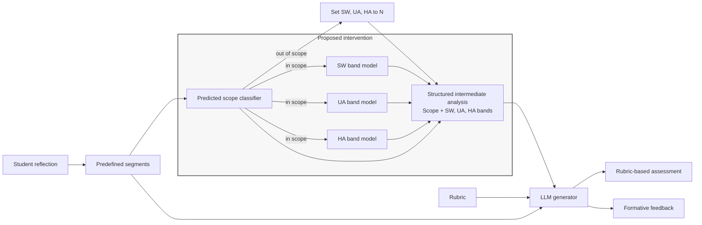
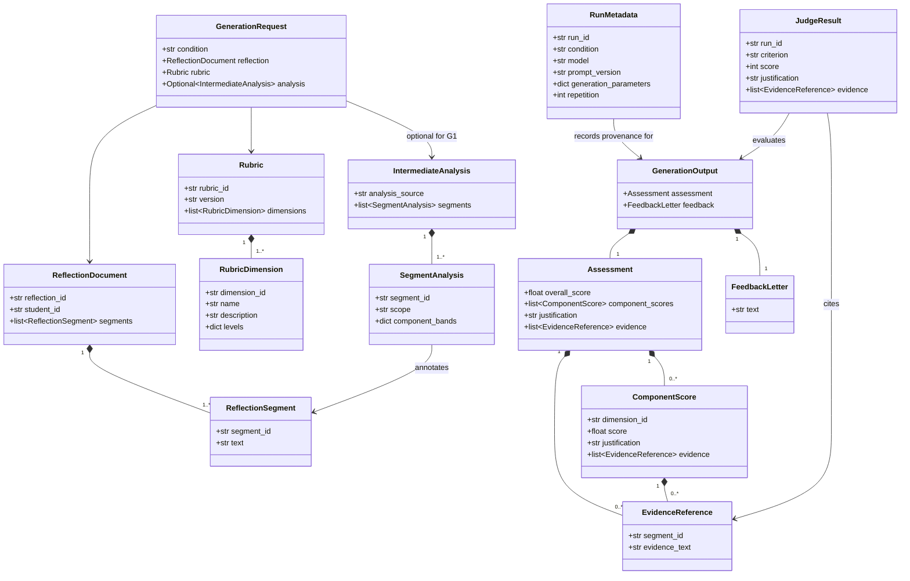

# Structured Intermediate Analysis for LLM-Based Assessment and Feedback

This experiment asks whether an LLM produces more accurate and consistent rubric-based assessment, and more diagnostic and reflection-stimulating feedback, when given structured analysis of a learner's reflection.

The intervention is **analysis-mediated generation**: a scope decision is made for each predefined segment; in-scope segments receive component-specific bands for SW, UA, and HA, which are supplied to the generator as a structured intermediate representation.

**Status:** Segment-classification notebooks and a shared G1/G2/G3 generation prototype are available. G2 prediction integration and the complete evaluation workflow remain in progress.

## Running the Notebooks

From the `prebi_v1` project root, install the environment and optional Gemini integration:

```bash
uv sync --locked --extra dev --extra gemini
```

Open a notebook in VS Code and select the workspace `.venv` Python kernel. Keep the working directory at the `prebi_v1` project root so relative data paths resolve.

### 1. Segment classification

Open [1_segment_classification.ipynb](1_segment_classification.ipynb) and run cells in order. The initial cells validate the prepared train/dev/test splits, show label distributions, and define the GBERT training and evaluation functions. Training is opt-in: in **Train and evaluate**, change `RUN_TRAINING` from `False` to `True`, then run that cell and the following evaluation cell. This downloads `deepset/gbert-base`, trains both classifier variants, evaluates on the held-out test split, and writes checkpoints and summaries under `artifacts/segment-classification/`. Keep artifacts and research data private. Do not use test results to choose models or hyperparameters.

### 2. G1/G3 generation demo

Open [G1_G3_Demo.ipynb](G1_G3_Demo.ipynb) and run the document-setup and tracing-policy cells first. Adjust `DOCUMENT_INDEX` to select an eligible document; the current demo reads the provisional test split, so reserve it for an approved pilot or final test, not prompt tuning. The final generation cell is deliberately gated: set `APPROVE_EXTERNAL_PROCESSING = True` only after confirming provider approval, and configure `GOOGLE_API_KEY` or `GEMINI_API_KEY` outside the notebook. It runs repeated G1 and G3 generations; outputs stay in notebook memory and are not automatically saved. LangSmith tracing is off by default; enable it only after confirming that the tracing workspace is approved for this protected text. Copy `.env.example` to `.env` and configure `LANGSMITH_API_KEY`, `LANGSMITH_PROJECT`, and the EU `LANGSMITH_ENDPOINT` to opt into tracing. The runner checks project access through the configured regional endpoint before calling the model, creates a traceable parent span around its Python generation orchestration, and nests the LangChain model call under that project.

Open [G2_Demo.ipynb](G2_Demo.ipynb) for the predicted-analysis condition. It uses the same shared request and runner implementation in `reflection_assessment_feedback/`, but requires classifier inference to produce a document-scoped predicted-analysis artifact under `PREBI_DATA_ROOT/g2/predicted-analysis.json`. That inference workflow is not implemented yet; the notebook will wait for the artifact and will not substitute G3 human labels.

## Research Questions

**RQ1.** Does structured intermediate analysis of reflection performance improve the accuracy and consistency of rubric-based assessment in an LLM-based system?

**RQ2.** Does structured intermediate analysis improve the diagnostic precision of generated formative feedback and its potential to stimulate learners to reflect more deeply?

We hypothesize that, compared with direct generation, analysis-mediated generation will produce more accurate and consistent rubric-based assessments (**H1**) and formative feedback with greater diagnostic precision and greater potential to stimulate learners to reflect more deeply (**H2**).

## Experimental Conditions

The experiment uses the same reflection texts, rubric, generator model, prompt template and shared prompt content, output schema, and generation settings across conditions. The only condition-specific addition to the generator input is segment analysis: it is omitted in G1, predicted in G2, and human-annotated in G3.

| Condition                                         | Generator input                                              | Role            |
| ------------------------------------------------- | ------------------------------------------------------------ | --------------- |
| G1<br />Direct generation                         | Segmented reflection + rubric                                | Baseline        |
| G2<br />Predicted-analysis-mediated intervention | Segmented reflection + rubric + predicted segment analysis | Proposed        |
| G3<br />Oracle-analysis-mediated                  | Segmented reflection + rubric + human-annotated segment     | Oracle/headroom |

---

The same prompt template, shared prompt content, and all other generator inputs are used in every condition. G2 and G3 differ only in the supplied analysis source. This allows G1 → G2 to estimate the effect of adding predicted segment analysis and G2 → G3 to compare predicted analysis with human-annotated analysis.

## Proposed Pipeline



For G2, a predicted scope decision runs first. Out-of-scope segments receive `N` for all three components; in-scope segments are passed to three parallel band classifiers, one each for SW, UA, and HA. G3 uses human annotations for both scope and component bands. The original segmented reflection remains available to the generator; the structured intermediate analysis enriches, rather than replaces, the source text.

## Conceptual Data Model

The diagram is explanatory, not the implementation contract. When the experiment is implemented, versioned schemas and validation tests under `experiments/extended_abstract/schemas/` and `experiments/extended_abstract/tests/` will be authoritative for structure and enforceable invariants. Research decisions such as rubric score levels, overall-score aggregation, and annotation rules belong in `experiments/extended_abstract/experiment_protocol.md`. These implementation files are planned and do not exist yet.



The experiment runner creates `run_id` and stores it with the generation output and run metadata. The model-generated payload contains only the assessment and feedback. Analysis is absent for G1 and required for G2 and G3.

### Illustrative Contract Examples

The examples below explain the intended shape; they are not normative schemas. The versioned schemas and tests will define and enforce exact fields and validation rules, including unique segment IDs, complete one-to-one analysis coverage for G2/G3, no analysis for G1, scope-to-label consistency, and scores constrained by the rubric.

A segment-level intermediate analysis records scope and one label for each component:

```json
{
  "analysis_source": "predicted",
  "segments": [
    {
      "segment_id": "segment_01",
      "scope": "in_scope",
      "component_bands": {
        "SW": "B",
        "UA": "0",
        "HA": "0"
      }
    },
    {
      "segment_id": "segment_02",
      "scope": "out_of_scope",
      "component_bands": {
        "SW": "N",
        "UA": "N",
        "HA": "N"
      }
    }
  ]
}
```

The predicted scope decision runs before the component models. If a segment is `out_of_scope`, the pipeline assigns `N` to all components and skips the component models. If it is `in_scope`, the three component models run in parallel and each predicts one of `0`, `A`, `B`, or `C`. `0` means there is no evidence for that component in an in-scope segment; `A`, `B`, and `C` are the component's reflection-performance bands. `N` means the whole segment is outside the reflection performance and is not a component band. The band descriptors and annotation rules must be defined consistently for predicted and human analyses.

For G3, `analysis_source` is `human`. G1 omits intermediate analysis.

All conditions produce the same model-generated payload shape; the runner adds the run ID separately:

```json
{
  "assessment": {
    "overall_score": 0,
    "component_scores": [],
    "justification": "...",
    "evidence": []
  },
  "feedback": {
    "text": "..."
  }
}
```

The experiment protocol must define the rubric score levels and how `overall_score` is derived from dimension scores before the output schema is frozen.

## Evaluation

The proposed operationalization evaluates assessment and feedback separately. Human reference scores and segment annotations should be finalized independently of the generated outputs. G1 vs G2 is the primary comparison; G2 vs G3 is a secondary comparison that estimates remaining headroom.

### Deterministic metrics

| Outcome                         | Metric and computation                                                                                                                                                                                                                                                                                                                               |
| ------------------------------- | ---------------------------------------------------------------------------------------------------------------------------------------------------------------------------------------------------------------------------------------------------------------------------------------------------------------------------------------------------- |
| Assessment accuracy (RQ1/H1)    | Mean absolute error (MAE) against adjudicated human reference scores, reported separately for overall score and each rubric dimension. Also report exact agreement on the rubric's allowed score levels.                                                                                                                                             |
| Assessment consistency (RQ1/H1) | For each reflection and score (overall and each dimension), calculate the standard deviation across repeated generations. Report the mean within-reflection standard deviation by condition; lower values indicate greater consistency.                                                                                                              |
| Predicted scope classifier      | Report per-class precision, recall, and F1, plus macro-F1, against human scope annotations.                                                                                                                                                                                                                                                          |
| End-to-end component labels     | For each of SW, UA, and HA, compare the full pipeline output with human labels across all segments, including`N` for out-of-scope segments. Report exact accuracy and macro-F1 across `N`, `0`, `A`, `B`, and `C`, plus class support and confusion matrices. This captures errors in both the scope gate and component-band classifier. |

For condition comparisons, first summarize repeated runs within each reflection, then compare conditions using paired reflection-level differences. Report 95% bootstrap confidence intervals by resampling reflections; do not treat repeated runs from one reflection as independent observations.

### Multidimensional rating criteria

The LLM judge and human raters use the same four criteria and 3-point anchors. Provide the reflection segments, rubric, and generated assessment/feedback; omit the condition, generator identity, intermediate analysis, and run metadata. Score each criterion separately:

| Criterion                        | 1: Not met                                                                                  | 2: Partly met                                                                           | 3: Clearly met                                                                                                                   |
| -------------------------------- | ------------------------------------------------------------------------------------------- | --------------------------------------------------------------------------------------- | -------------------------------------------------------------------------------------------------------------------------------- |
| Assessment justification         | Rationale is absent, contradicts the score, or does not use the rubric.                     | Rationale is partly rubric-aligned but leaves important scores or evidence unexplained. | Rationale explains the scores using the relevant rubric descriptors and reflection evidence.                                     |
| Evidence grounding               | Key assessment or feedback claims are unsupported, contradicted, or cite the wrong segment. | Some claims are supported, but support is vague, incomplete, or uneven.                 | Key claims are accurate and supported by relevant, correctly identified reflection segments.                                     |
| Feedback diagnostic precision    | Feedback is generic, misdiagnoses the reflection, or identifies no specific gap.            | Feedback identifies a plausible gap but is vague, incomplete, or partly inaccurate.     | Feedback accurately identifies a specific gap and grounds it in the reflection and relevant rubric expectations.                 |
| Reflection-stimulating potential | Feedback does not invite further reflection, closes it down, or supplies a leading answer.  | Feedback invites reflection but does so generically or at limited depth.                | Feedback uses a relevant, open prompt to help the learner examine reasoning, evidence, assumptions, alternatives, or next steps. |

Each LLM-judge result contains one integer score (`1`, `2`, or `3`) per criterion, a short justification, and segment references where applicable. Report criterion-level distributions; do not combine criteria into a primary aggregate. A mean criterion score may be included as a secondary summary. Freeze the judge model, prompt, and decoding settings, and pilot the anchors on a human-reviewed sample before full evaluation. LLM-judge ratings are preliminary automated evidence, not a substitute for human ratings.

### Human multidimensional ratings

For human validation, at least two teacher-educator raters independently score a prespecified sample. For each reflection, select one run per condition using a fixed random seed before rating; use the same selected G1, G2, and G3 outputs for multidimensional and pairwise ratings. Raters see the reflection, rubric, and generated output, but not condition or intermediate analysis.

Report quadratic weighted Cohen's kappa per criterion from the independent ratings before adjudication. Resolve disagreements through a documented adjudication process. Then, for each of G1, G2, and G3, report the number of reflections rated and, for each criterion, the count and proportion at scores 1, 2, and 3, plus the median and interquartile range of adjudicated ratings. Compare adjudicated per-reflection ratings for G1 vs G2 (primary) and G2 vs G3 (secondary), with paired differences and 95% bootstrap confidence intervals resampled by reflection.

### Human pairwise feedback comparison

Using the same selected outputs, raters compare feedback for G1 vs G2 and G2 vs G3. Randomize left/right order independently for each comparison and record `1` if the first output is preferred, `2` for a tie, and `3` if the second output is preferred. Retain the display-order mapping, adjudicate disagreements, and report for each contrast the count and proportion preferring either condition or indicating a tie, with 95% bootstrap confidence intervals resampled by reflection. Report raw inter-rater agreement and Cohen's kappa for pairwise choices.

An automated LLM-judge result follows a structured contract such as:

```json
{
  "run_id": "run_...",
  "criterion": "evidence_grounding",
  "score": 3,
  "justification": "...",
  "evidence": [
    {
      "segment_id": "segment_03",
      "evidence_text": "..."
    }
  ]
}
```

The runner associates this model response with its `run_id` and provenance metadata.

## Repeated Runs

Generate each reflection multiple times per condition. Summarize repeated-run variation within each reflection before comparing conditions.

The experiment is an offline research workflow; PDF ingestion and deployment are out of scope.

## Data and Privacy

The research corpus contains student reflective writing and should **not be published in this repository unless its release is explicitly permitted**.

A public version of the repository should contain the experiment code, prompts, schemas, configuration, documentation, aggregate results, and synthetic examples. Raw reflections, human annotations, and generated outputs that reproduce identifiable source text should remain in approved protected storage where required.

`student_id` is included in the conceptual model for internal linkage only and should be pseudonymous. Public experiment artifacts should not expose student identifiers.
